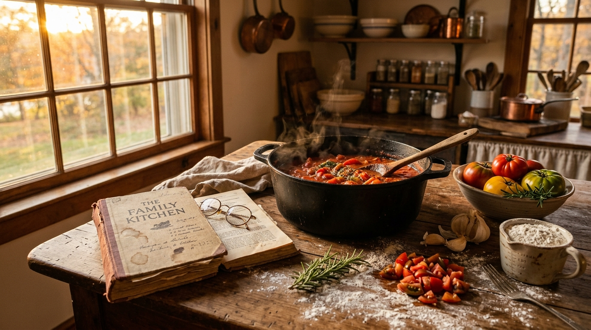

*This is a submission for the [Hacktoberfest Weekend Challenge: Build for a Friend](https://dev.to/challenges/hacktoberfest-weekend-2026-10-01)*

# EchoRecollect — Family Recipe & Story Preserver 📖🎙️

## What I Built

Every family has that one beloved relative—a grandmother, grandfather, or favorite aunt—whose food feels like magic. But whenever you ask them for the recipe, you get a sprawling, beautiful, disorganized story instead of a list:

> *"Oh honey, back in Brooklyn when Papa worked double shifts at the docks in Red Hook, the scent of browning garlic greeted him three blocks away. You need two cans of San Marzanos—crush them with cold hands, don't you dare use a blender! First heat the olive oil in your heaviest pot, brown the sausage until caramelized, and simmer it slow for hours..."*

I built **EchoRecollect** for my family and loved ones who cherish these memories. Traditional recipe apps fail for older relatives because they demand rigid forms: "Prep Time (minutes)", "Ingredient (grams)", "Step 1". Grandparents don't speak in forms—they speak in stories, nostalgic memories, and sensory recollections.

**EchoRecollect** bridges this generational divide:
1. **🎙️ Voice Memo & Story Logger**: Relatives can speak naturally using live speech recognition or dictated voice memos, or loved ones can paste rambling transcripts and voice notes.
2. **🪄 AI Recipe & Story Extractor**: A dedicated natural language processing engine parses the conversational flow and separates it into four distinct structured sections:
   - **Recipe Title** (inferred with heirloom flair)
   - **Family Anecdote & History** (the heart and soul of the memory, preserved as a keepsake quote)
   - **Structured Ingredients List** (normalized quantities, units, and items with quick add/edit controls)
   - **Step-by-Step Instructions** (clean sequential cooking directions free of conversational clutter)
3. **📚 Digital Cookbook Library**: A searchable, filterable archive of family recipes organized by storyteller, era, and course, complete with interactive cook-along checklists.
4. **🖨️ Print & Export Keepsake Tool**: Formats recipes into gorgeous, vintage-bordered 4x6" and 8.5x11" keepsake cards with custom print stylesheets (`@media print`), plus offline JSON archive exports.
5. **⚙️ Personalization & Themes**: Custom family name (*e.g., "The Rossi Family Cookbook"*) across all headers, cards, and printouts, with four heirloom themes (*Warm Hearth, Vintage Parchment, Midnight Kitchen, Rosewood & Flour*).

---

## Demo

- **Live Demo Link**: [Deploy on GitHub Pages / Vercel / Netlify — *insert your deployed URL here*]
- **Local Preview**: Clone the repository and run `python -m http.server 3000`, then visit `http://localhost:3000`.

### App Highlights & Screenshots:
- **Heirloom Voice Memo & Waveform Logger**:
  
- **Extracted Keepsake Card Preview**: Automatically isolates the emotional backstory into a framed lore section while formatting actionable cooking steps.
- **Printable Keepsake Mode**: Direct browser printing formatted cleanly with ornamental borders for physical family recipe boxes.

---

## Code

The full open-source codebase is hosted on GitHub:
👉 **[GitHub Repository: EchoRecollect](https://github.com/AABHAYRANJANPANDEY/EchoRecollect)**



The project is structured with zero heavy dependencies:
- `index.html`: Semantic HTML5 structure with accessible IDs and meta tags.
- `styles.css`: Custom warm heirloom aesthetic design system with `@media print` optimization.
- `extractor.js`: Heuristic NLP extraction engine tailored for oral family dictations.
- `sample-recipes.js`: Pre-loaded heirloom recipes and authentic audio presets.
- `app.js`: State manager, Web Speech API controller, audio waveform visualizer, and print generator.

---

## How I Built It

EchoRecollect was designed with simplicity, longevity, and warmth at its core:

1. **Lightweight, Zero-Build Architecture**: 
   Vanilla HTML5, modern CSS3, and JavaScript ensure the application runs instantly on any device or browser without complex build pipelines, node server overhead, or fragile frameworks that break over time.
2. **Web Speech API & Audio Visualizer**:
   Uses the browser's native `SpeechRecognition` API for live voice dictation, accompanied by a dynamic `<canvas>` audio waveform renderer and a simulated dictation player with authentic typing animations.
3. **Natural Language Recipe & Lore Heuristics Engine**:
   Built a specialized extraction parser (`extractor.js`) that analyzes conversational cadence. It identifies nostalgia triggers (*"back in", "when I was", "secret was always"*) to isolate oral family history into a dedicated keepsake section, while extracting measurements, units, ingredients, and action verbs into clean cooking steps.
4. **Print-First CSS (`@media print`)**:
   Designed dedicated print media queries that strip away navigation, controls, and buttons, automatically formatting the recipe into a 4x6" / 5x7" or letter-size heirloom card ready for physical binder preservation.
5. **Offline-First Data Portability**:
   `localStorage` persistence paired with full JSON archive export and import means family recipes are never locked into a proprietary cloud database.

---

## Why Does Open Innovation Matter?

Family memories and generational recipes are among the most intimate and personal heirlooms we own. 

1. **Privacy & True Ownership**: Closed-source, subscription-based platforms often monetize user data, lock recipes behind paywalls, or shut down after a few years. Open innovation ensures that family recipes, voice notes, and oral stories remain 100% private, locally stored, and freely exportable in open formats like JSON and standard print.
2. **Longevity Over Decades**: Web standards outlive proprietary apps. A family cookbook built on open HTML, CSS, and portable JSON will still be readable and printable 30 years from now.
3. **Empowering Personal Creation**: Open-source tools and accessible AI enable individuals to build customized solutions tailored to their family's unique traditions and cultural heritage, rather than settling for generic one-size-fits-all software.

---

## My Agent Session

This project was pair-programmed and architected using an AI coding assistant session, iterating on:
- Designing the dual live/simulated voice recording interface.
- Refining natural language regex heuristics to handle conversational oral dictations without losing ingredients.
- Crafting a print-ready CSS stylesheet for physical recipe cards.
- Ensuring responsive UI and accessible interaction flows across desktop and mobile.

---

## Prize Categories

- **Primary**: Build for a Friend / Loved One
- **Additional**: Most Creative Use of Open Web Technologies & AI Heuristics

---

*Preserve the recipes, the laughter, and the stories behind every meal with EchoRecollect.*
